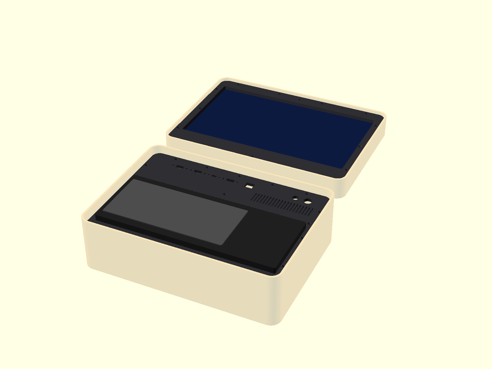

# Apache 3800 Cyberdeck — panels CAD

Parametric OpenSCAD panels for a cyberdeck built into a Harbor Freight
**Apache 3800** case (item 63927).

- **Lid:** screen panel + screen clips + lid brackets (this repo).
- **Base:** keyboard / ports faceplate that screws onto the
  [Apache 3800 Panel Bracket](https://www.printables.com/model/1478000-apache-3800-panel-bracket)
  by JohnS - N0CTL (print that ring separately; its hole pattern is built in here).



## Layout

| File | What it is |
|---|---|
| `config.scad` | **Every dimension lives here.** Case, screen preset, ports, keyboard, printer bed, fasteners. |
| `parts/lid_panel.scad` | Screen bezel: window with 45° bevel, retainer bosses on the back, countersunk mount holes. |
| `parts/screen_retainer.scad` | Flat clips that screw onto the bosses and clamp the screen. |
| `parts/lid_bracket.scad` | Posts for the lid floor (insert top + bottom) — lid-side equivalent of the Printables bracket. |
| `parts/base_faceplate.scad` | Keyboard battery-hump slot, port cutouts, vent grille, holes matching the Printables bracket ring. |
| `view_stls.scad` | Imports the exported STLs so you can look at them (F5). |
| `assembly.scad` | Fit-check: case opened flat with both panels. Preview only. |
| `scripts/export.sh` | Renders every part to `stl/` and previews to `img/`. |
| `scripts/step_info.py` | Reads holes / extents / faces out of STEP files (how third-party parts were measured). |
| `docs/DESIGN.md` | Design record: every decision, measurement source, open question. |
| `CLAUDE.md` / `AGENTS.md` | Guide for AI agents (and humans) working on the repo. |
| `ref/` | Notes on reference dimensions. |

Coordinates: origin at the centre of the case opening; **−Y = handle (front)**,
**+Y = hinge (back)**; panel front face is the top (+Z).

## Workflow

1. Edit `config.scad` (screen preset, port list, keyboard size, `bed`).
2. Open `assembly.scad` in OpenSCAD, press **F5** to fit-check.
3. Export STLs from Git Bash in the repo root:
   ```bash
   scripts/export.sh
   ```
   ~10 s with an OpenSCAD **development build** (2024+, Manifold engine); the
   script finds one under `%LOCALAPPDATA%\Programs\OpenSCAD-Nightly` and falls
   back to the 2021.01 release (~35 min). Get builds from
   openscad.org → Downloads → Development Snapshots. Single part:
   `openscad --backend=manifold -D 'piece=[0,1]' -o out.stl parts/lid_panel.scad`.

## Splitting for the printer

The panels are ~380 × 270 mm. If they exceed `bed` (default 256 × 256) they are
cut into tiles with a **half-lap joint**: the back half of one tile overlaps the
front half of its neighbour across a `lap_w` band. Each seam gets M3 countersunk
screws (front) + hex-nut pockets (back) every `seam_hole_pitch` mm — glue the lap
too. Force a layout with e.g. `lid_split_x = [0]; lid_split_y = [];`, or set
both to `[]` for a single piece on a big bed. Tiles export as
`<part>_tile_<i>_<j>.stl`.

## What's measured vs. assumed

**From the Printables bracket STEP (v8):**
- Case interior at bracket height: **380 × 270 mm, R17 corners.**
- 16 M3 insert positions of the 4-piece bracket ring → `base_mount_holes`.
- Bracket height 17 mm.

**From Harbor Freight spec:** inside 383 × 271 mm at the rim, lid depth 44 mm,
base depth 108 mm.

**MEASURE before printing** (tagged in `config.scad`):
- `lid_panel_drop` — how far below the lid rim the screen panel sits (gasket lip).
- `base_panel_drop` — where your brackets end up below the base rim (16 mm default so the lid clears the keyboard).
- Screen preset dimensions — all approximate; caliper your panel + driver board.
- Port type sizes — generic panel-mount extensions vary.

## Screen: portable "travel" monitor

Default `screen = "travel15.6"` (also `"travel14"`). A travel monitor is a whole
unit in its own ~9 mm shell, so the panel frames its glass and the clips clamp
the shell edge — no teardown needed. To fit yours, measure and edit its preset:

- outer shell width × height × thickness (`module_w/h/t`)
- visible picture area width × height (`active_w/h`)
- picture-centre offset: travel monitors have a thicker bottom chin, so the
  picture sits **higher** than the shell centre (`active_off_y`, ~+5–10 mm)

Things to plan for: its USB-C / mini-HDMI ports and OSD buttons are on the shell
edges, which end up behind the panel — check that the cable plugs (often
right-angle ones are needed) clear the lid brackets, and set brightness before
mounting.

## Keyboard: Logitech K400 Plus (sits on top)

The K400 sits **flat on top of the faceplate**. Only its battery hump (the
thicker strip along its back edge, ~8 mm deeper than the flat underside)
drops through a **347 × 35 mm slot** in the plate. The hump in the slot also
locates the keyboard so it can't slide; add a few velcro dots if you want it
held down. Lift it off to use it wirelessly or change batteries.

- The slot sits under the keyboard's back edge (keyboard centred at
  `kb_offset`, hump toward the hinge). All 16 bracket holes are used.
- With the keyboard on top it stands ~14 mm above the plate, so the plate is
  set **16 mm below the base rim** (`base_panel_drop`) — that leaves ~8 mm
  between the keys and the lid panel when the case is closed. Mount the
  brackets at that height (or change the value and re-export).
- The horizontal print seam sits behind the keyboard (`base_split_y = [44]`);
  ports and vent are in the strip behind it.

Details: `ref/k400-plus.md`.

## License

[MIT](LICENSE) © MosheWelcher — except third-party files in `ref/`, which keep
their own licenses (listed in [`NOTICE`](NOTICE) and below).

## Credits

- **Apache 3800 Panel Bracket** by JohnS - N0CTL —
  [Printables 1478000](https://www.printables.com/model/1478000-apache-3800-panel-bracket),
  [CC BY 4.0](https://creativecommons.org/licenses/by/4.0/). Original STEP included
  unmodified in `ref/`; `base_mount_holes` and the case interior/corner dimensions
  are derived from it. See `ref/printables-bracket.md`.
- **Logitech K400 Plus** model by Tomáš Stroka —
  [GrabCAD](https://grabcad.com/library/logitech-k400-plus-2); keyboard
  outline and underside profile measured from it (file not redistributed).

## Hardware

- M3 heat-set inserts (M3 × 5.7, 4.0 mm hole)
- M3 countersunk screws: 10 mm (6 mm panels), M3 hex nuts (seams)
- Foam tape for `screen_shim`
- Print: PETG / ABS / ASA-GF, 4 walls, 4 top/bottom, 30–45 % infill.
  Print panels front-face-down for a clean visible side.
